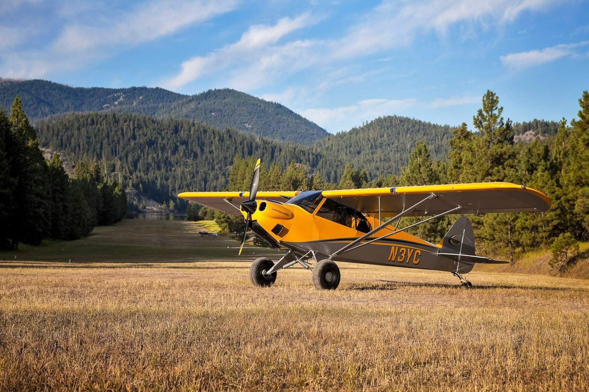
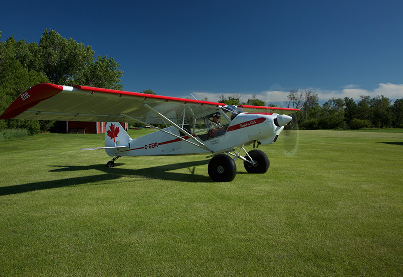
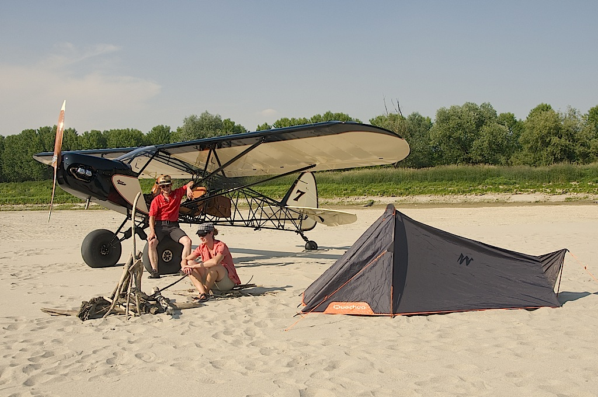
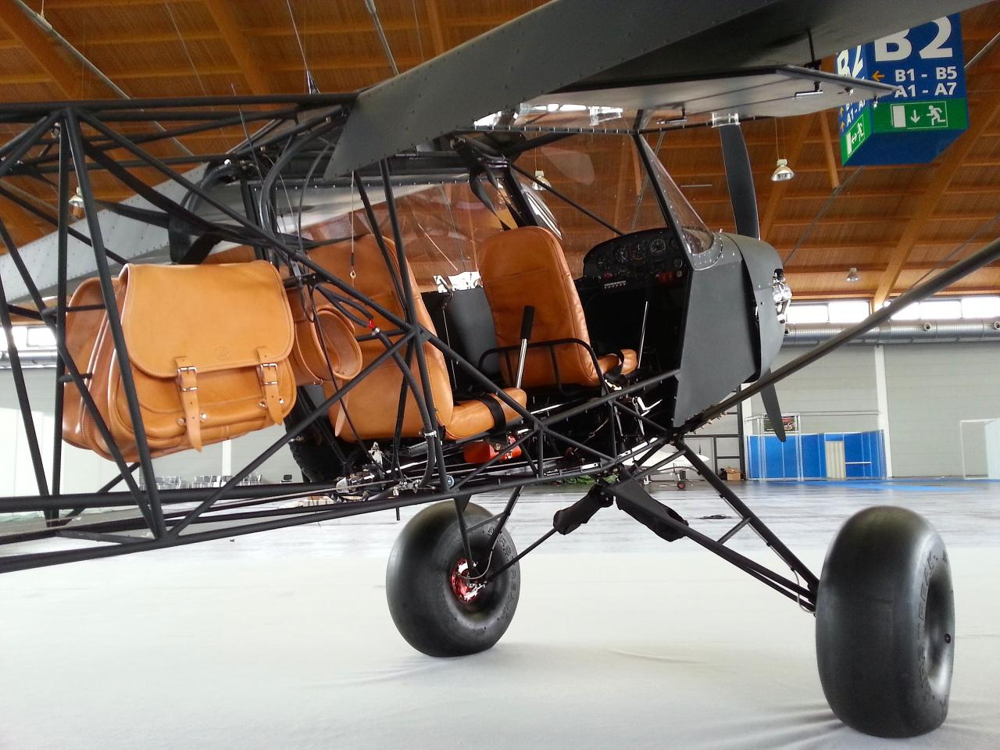
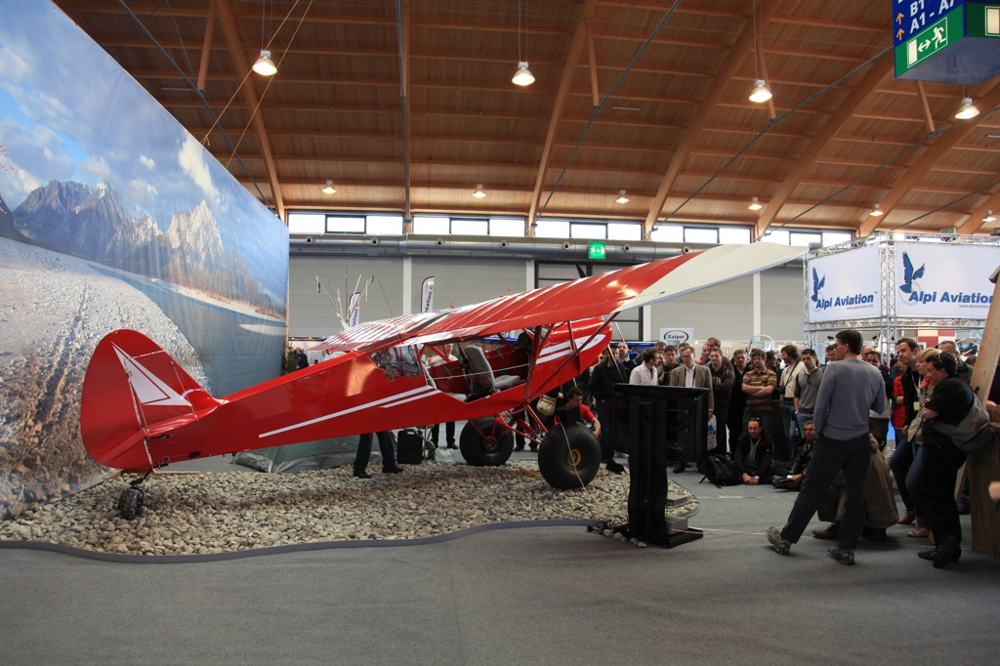
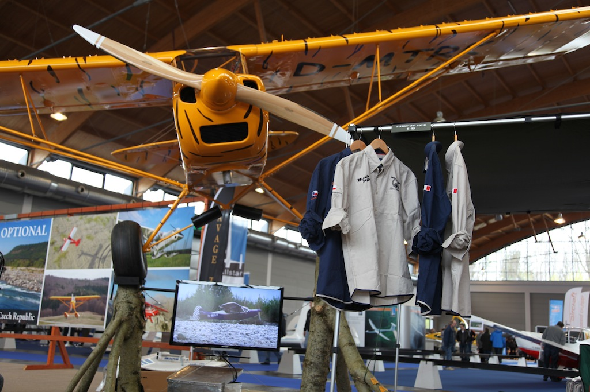
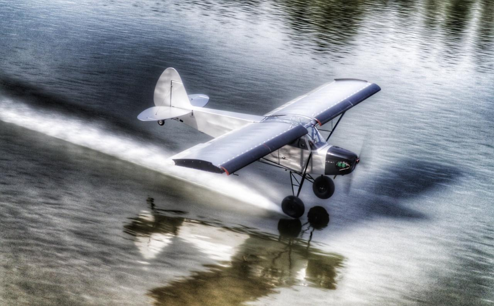
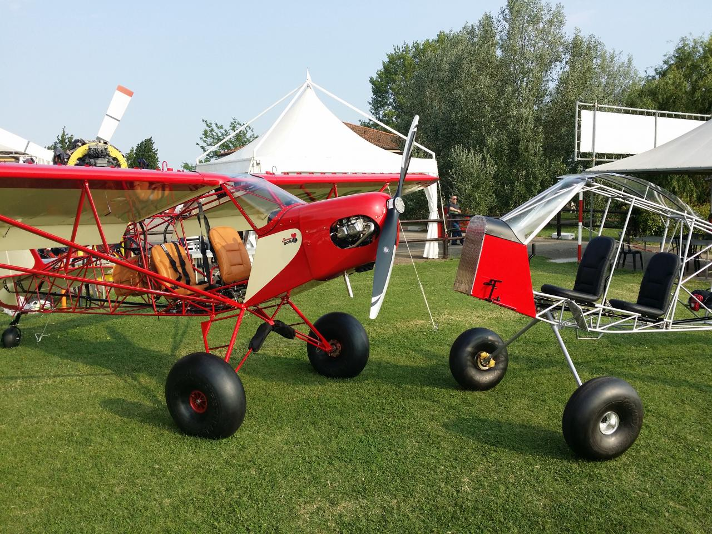
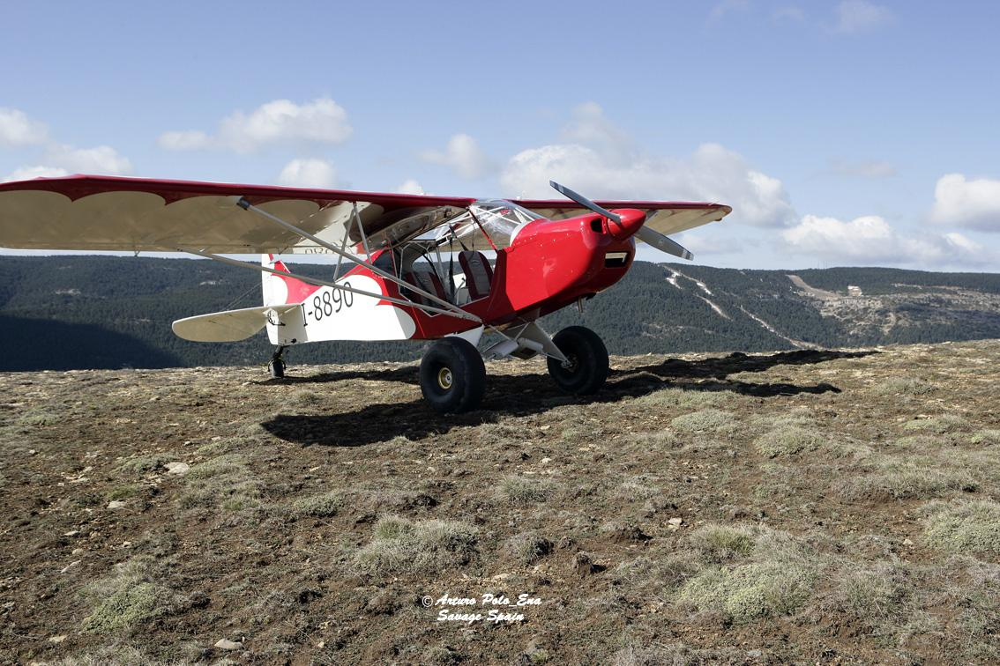
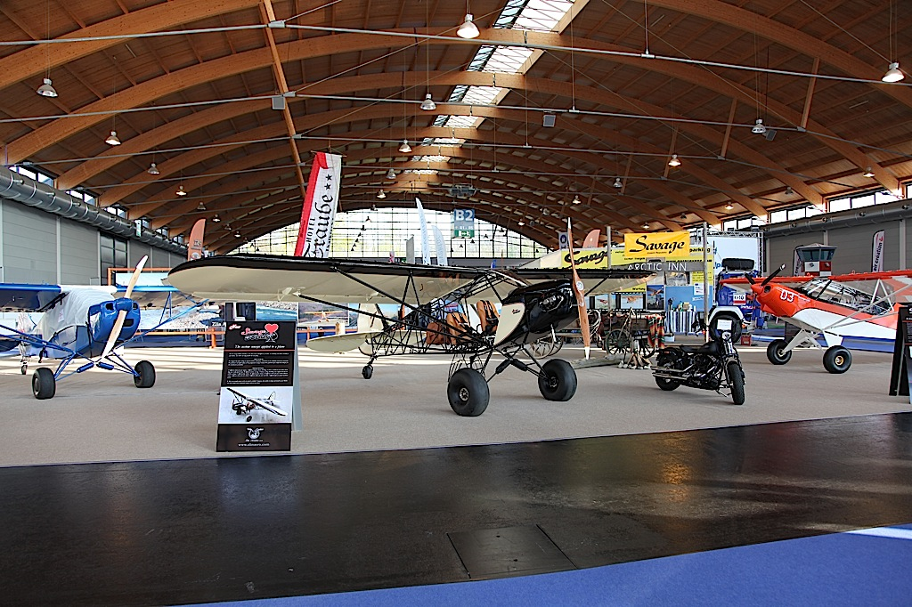

# The Most Exiting Bushplanes Ever #
## [Justaircraft](https://justaircraft.com/) ##

## [Cubcrafters](http://cubcrafters.com/) ##

## [Supercub](https://www.supercub.com/) ##

## [Zlin](https://zlinaero.com/) ##

## [Legend](https://legend.aero/) ##
th = "440"/>
