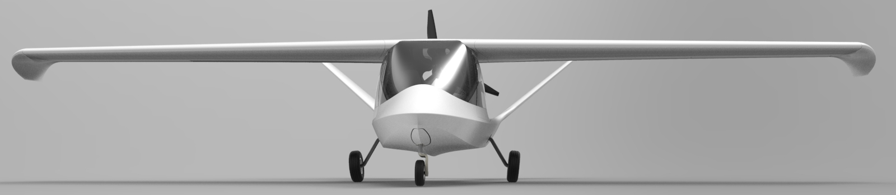

[English](https://github.com/chaosign/LEAP/blob/master/readme_en.md)
# 力派 （Leap）*开源飞机项目*

LEAP —— Life Edge Aircraft Project
【力派】 是由飞机设计师 文子 倡导发起的开源轻型运动飞机项目。 我们试图用 **开源、航空规范 、协同、创新** 等观念，去代替 自制、冒险、个人英雄主义、经典 之类的表述，从而传递我们的飞行哲学。电视里自制飞机翱翔蓝天的新闻，随时间推移，已成往事，按图造飞机也不再是稀罕事儿。同样地，我们可以把 钢管 换成 复材，把 “DIY创客” 的草莽情怀，增添一些 适航探索 的科学本色。

## 目标
研制 **安全 炫酷 不贵 开源** 的运动娱乐飞机。
我们将首先开发两款轻型运动飞机：短距起降越野飞机 | 水陆两栖运动飞机。

任何个人和组织都可以加入到项目中，参与文本的编写、修订和翻译、贡献设计、提供资金、销售或提供相关产品及服务，甚至参与飞机的建造和飞行。

## 项目支持
- QQ群：飞行-从织梦到翱翔 | 935712655 
+ 微信群：
- 微信公众号：
+ 项目托管空间： https://github.com/chaosign/leap
// - 项目官网：http://www.chaosign.com/ 

## 文件夹说明
力派 飞机项目 托管在 GitHub 上，文本文档使用英文和汉语两种语言。
- chinese             平行中文文档
+ design              飞机总体设计文档
- modeling            飞机三维模型文件
+ engineering         项目工程文件
- knowledge           相关知识、法规等
+ similar_lsa         参考机型\顶级lsa
- others              其他
+ upload_by_members   上传你的图片和视频等

## 如何加入
除了飞机和飞行所需的知识，您仅仅还需要
- 学一点[GitHub使用技巧](https://guides.github.com/activities/hello-world/)
+ 注册一个GitHub账户
- 加入“飞行-从织梦到翱翔” QQ 群，向群主提交申请
便可开启您的飞行织梦之旅。
