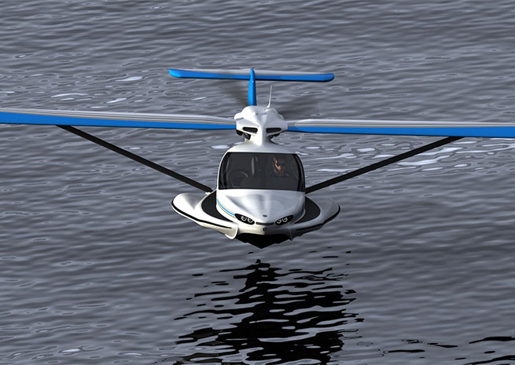

# The Most Exiting LSAs Ever #
## [Equator P2 Xcursion](https://www.equatoraircraft.com/) ##

## [Lisa](http://lisa-airplanes.com/) ##

## [MVP](https://www.mvp.aero/) ##

## [Vickers Wave](https://www.vickersaircraft.com/) ##

## [Icon A5](https://www.iconaircraft.com/) ##

